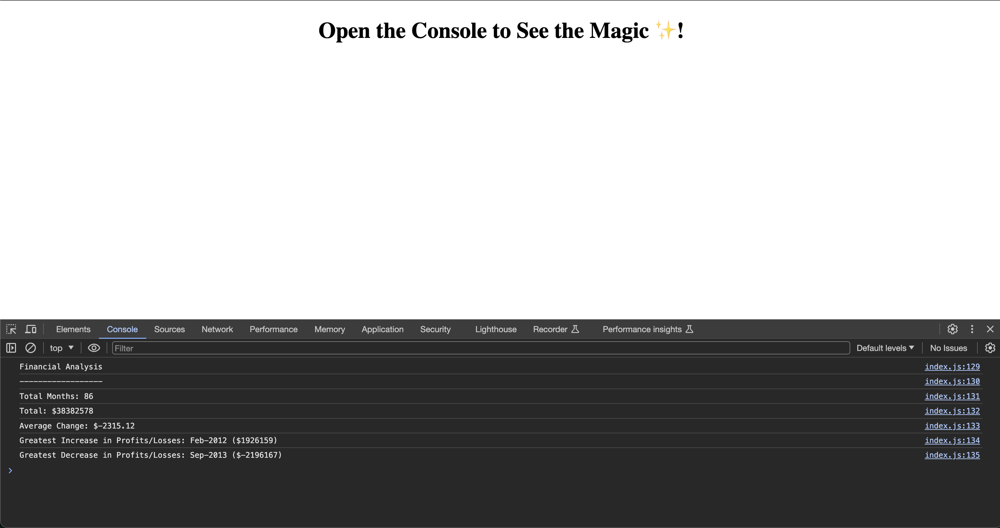

# Console Finances

Welcome to Console Finances! This JavaScript application analyzes financial records, providing insights into the total number of months, net total amount, average change in Profit/Losses, greatest increase, and greatest decrease in Profits/Losses over a given period.

## Table of Contents

- [Introduction](#introduction)
- [Features](#features)
- [Getting Started](#getting-started)
- [Usage](#usage)
- [Screenshots](#screenshots)
- [Deployment](#deployment)
- [Contributing](#contributing)
- [License](#license)

## Introduction

Console Finances is a financial analysis tool built with JavaScript. It's designed to assist in understanding key metrics from a provided financial dataset.

## Features

- Total number of months calculation.
- Net total amount calculation.
- Average change in Profit/Losses calculation.
- Identification of the greatest increase and decrease in Profits/Losses.

## Getting Started

To get started with Console Finances, follow these steps:

1. Clone this repository to your local machine.

```bash
  git clone https://github.com/EDXBootcamp/Console-Finances.git
```

2. Open the `index.html` file in a web browser.
3. Open the browser console to view the financial analysis.

## Usage

The financial analysis results will be displayed in the browser console. Make sure to have the browser console open when running the application.

## Screenshots



## Deployment

The application is deployed and accessible online. Visit the live version [here](https://edxbootcamp.github.io/Console-Finances/).

## Contributing

If you would like to contribute to this project, please follow these steps:

1. Fork the repository.
2. Create a new branch for your feature or improvement.
3. Make changes and submit a pull request.

## 🚀 About Me

I'm a full stack developer...

## 🔗 My Links

[](https://github.com/tjthouhid//)
[](https://www.linkedin.com/in/tjthouhid)
[](https://twitter.com/tjthouhid)

## License

This project is licensed under the [MIT License](LICENSE).
